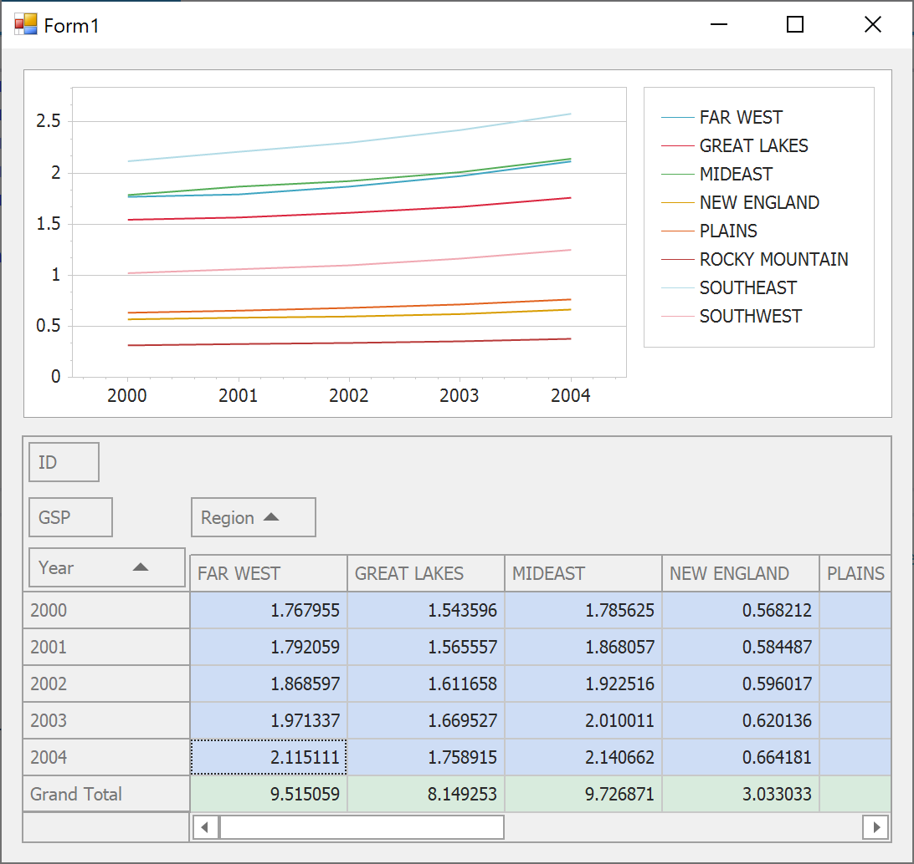

<!-- default badges list -->

<!-- default badges end -->

# How to link a chart to an XtraPivotGrid control

This example demonstrates how you can link a [ChartControl](https://docs.devexpress.com/WindowsForms/DevExpress.XtraCharts.ChartControl) to a [PivotGridControl](https://docs.devexpress.com/WindowsForms/DevExpress.XtraPivotGrid.PivotGridControl).
For an illustrated step-by-step tutorial, refer to the following document in our online documentation: [How to: Link a Chart to the PivotGridControl's Data Source](https://docs.devexpress.com/WindowsForms/5677/controls-and-libraries/chart-control/examples/creating-charts/providing-data/how-to-link-a-chart-to-the-pivotgridcontrols-data-source).

<!-- default file list -->
## Files to Look At

* [Form1.cs](./CS/Pivot_Chart_1/Form1.cs) (VB: [Form1.vb](./VB/Pivot_Chart_1/Form1.vb))
<!-- default file list end -->
## Documentation

* [Pivot Charting (Integration with a Pivot Grid Control)](https://docs.devexpress.com/WindowsForms/8695/controls-and-libraries/chart-control/provide-data/pivot-charting-integration-with-a-pivot-grid-control)

## More Examples

* [WinForms - How to Print a Document that Contains Pivot and Chart Controls](https://github.com/DevExpress-Examples/winforms-print-pivot-and-chart-controls)
